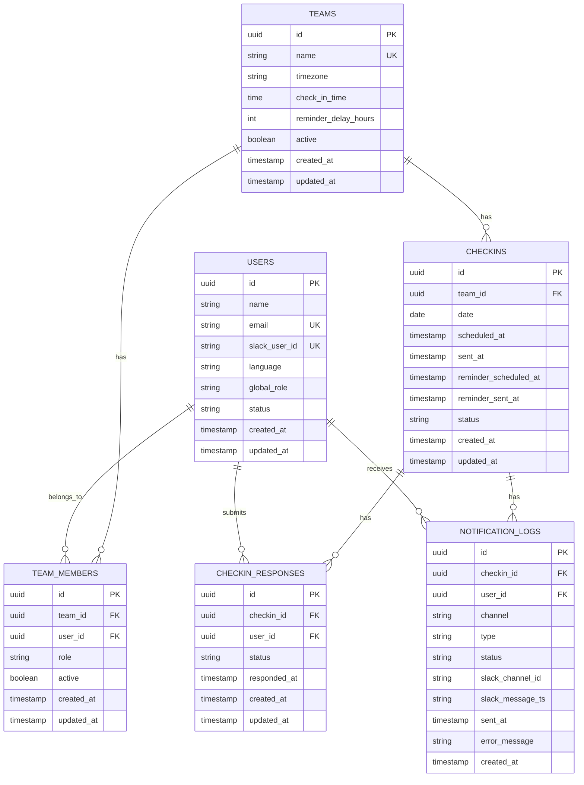

## Constraints

- `teams.name` — unique
- `users.email` — unique
- `users.slack_user_id` — unique, nullable
- `team_members(team_id, user_id)` — unique
- `checkins(team_id, date)` — unique
- `checkin_responses(checkin_id, user_id)` — unique
- `notification_logs(checkin_id, user_id, type)` — unique
